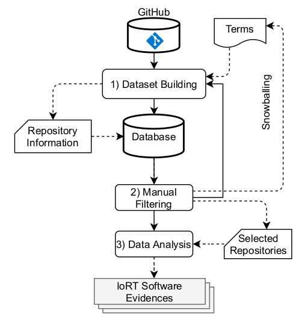

# Replication Package of Paper at SBCARS 2021

Our methodology consists of 3 main phases, as illustrated in the figure bellow. You can get aware of it by checking [our paper](https://nuvem.utfpr.edu.br/index.php/s/jWcSX4fDkBYdvnJ).




## Building the Dataset

Most of the process was automated by using shell scripts+GitHub REST API, as you will see in the sequence. We also provide the Python scripts that crawl the GitHub repositories. That was the first try, when we faced problems with [more than 1000 repositories](https://github.com/sourcegraph/sourcegraph/issues/2562). We do not get into details with this.

Our scripts are organized as the following:

```
./scripts/
    |--- crawling/     		    Scripts in Python that automate GitHub crawling with Selenium.
         |--- setup.sh          Shell script that installs Selenium chromedriver.
         |--- requirements.txt  Python dependencies. Type "pip install -r requirements.txt".
         |--- keywords          List of terms to be searched.
         |--- getdata.py        Python script that crawls GitHub.
    |--- git_api/       		Shell scripts that automate the search with Git REST API.
         |--- extract.sh        Shell script that extracts GitHub content into JSON files.
         |--- run.sh            Shell script where the extract.sh parameters are set.
         |--- mine.py           Python script to convert JSON content into CSV files (single file yet).
```

1) For extracting repositories with Git RES API, just set up the parameters in the ==run.sh==, then run it.
```
$ ./run.sh
```

2) In order to make it easier to interact, we export JSON content to a SQLite dataset:
```
$ pythong mine.py
```

2) Now you can manually export SQlite tables to CSV files. Check [this](https://www.sqlitetutorial.net/sqlite-tutorial/sqlite-export-csv/).

## Manual Data Analysis

You got here, so it seems that you are interested, right? Check out our data analysis [here](https://docs.google.com/spreadsheets/d/1CsLUjaCNy3LT6rFMImbM0fqySriKSE5gOBEp0ZMEQho/edit?usp=sharing)

If you either find inconsistencies or need some extra explanation, drop us [email](mailto:michelalbonico@utfpr.edu.br).

## Check our Presentation for SBCARS

The slides are available [here](#).

This is the recorded video.

## Selected Repositories

This work resulted in the following list of IoRT repositories (sorry for the image).


